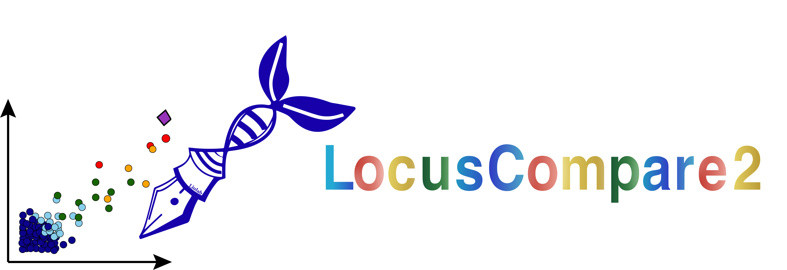

# LocusCompare2 

LocusCompare2 is an interactive visualization tool for genetic association analysis of GWAS dataset and eQTL dataset.

## Overview

LocusCompare2 integrates 6 popular colocalization tools:
+ SNP-level colocalization: [coloc](https://github.com/chr1swallace/coloc), [fastEnloc](https://github.com/xqwen/fastenloc), [finemap](http://christianbenner.com/)
+ Mendelian randomization: [SMR](https://yanglab.westlake.edu.cn/software/smr/#Overview)
+ Transcriptomic association: [PrediXcan](https://github.com/hakyimlab/PrediXcan) and [TWAS](http://gusevlab.org/projects/fusion/)

It could run all the colocalization tools above, display summary report and give manhattan plot and LocusCompare plot for 
the significant SNPs and genes.

## Get started

### Online use

You can visit our online website [https://locuscompare2.com](https://locuscompare2.com) to use locuscompare2.

###  Source code

- For university researchers, you can access our source code through your educational email. Please download it from the code access application portal. [https://download.locuscompare2.com](https://download.locuscompare2.com)

- For commercial users, please contact Fei (e1124850@u.nus.edu)

## License

**This project is released under the [Dual Licensing Options](LICENSE).**
