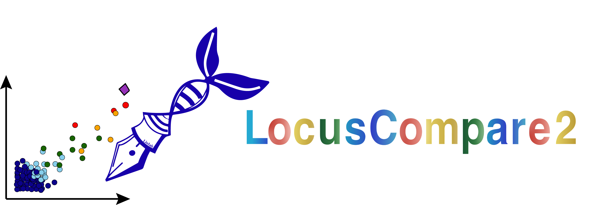

# LocusCompare2 [](https://www.locuscompare2.com/)

LocusCompare2 is an interactive visualization tool for genetic association analysis of GWAS dataset and eQTL dataset.



## Overview

LocusCompare2 integrates 6 popular colocalization tools:
+ SNP-level colocalization: [coloc](https://github.com/chr1swallace/coloc), [fastEnloc](https://github.com/xqwen/fastenloc), [finemap](http://christianbenner.com/)
+ Mendelian randomization: [SMR](https://yanglab.westlake.edu.cn/software/smr/#Overview)
+ Transcriptomic association: [PrediXcan](https://github.com/hakyimlab/PrediXcan) and [TWAS](http://gusevlab.org/projects/fusion/)

It could run all the colocalization tools above, display summary report and give manhattan plot and LocusCompare plot for 
the significant SNPs and genes.

## 1. Setup Environment

### 1.1 Run with Docker/Singularity (recommended)

We provid a [Docker image](https://hub.docker.com/r/junbingao/locuscompare2) to help users run directly on their servers or HPC.

1. Prepare Data, here is an example of the data you need to use

```
/locuscompare2file/GWAS.tsv.gz
/locuscompare2file/eQTL.tsv.gz
/locuscompare2file/vcf_hg38/
/locuscompare2file/genecode.v26.basic.annotation.gtf.gz
/locuscompare2file/ld_block_loci_file
/locuscompare2file/TWAS_weights/
/locuscompare2file/predixcan_db/
```

2. Start a docker and map these files into the docker container

```shell
# $working_dir is the local location where you want the output file to be stored
docker run -it -v /locuscompare2file:/root/locuscompare2-standalone/data -v $working_dir:/root/locuscompare2-standalone/working_dir -d junbingao/locuscompare2:latest /bin/bash
```

3. Activate the LocusCompare2 virtual environment by execute:

```shell
conda activate locuscompare2
```

### 1.2 Manual installation

1) Install [miniconda](https://docs.conda.io/en/latest/miniconda.html)
2) Follow instructions to install  [fastEnloc](https://github.com/xqwen/fastenloc/tree/dev/src) (See the Q&A section for more help on installation)
3) Clone locuscompare2 from [github](https://github.com/boxiangliulab/locuscompare2-standalone.git)
4. Execute the [environment set up script](./running_env/setup_env.sh) in `running_env` folder

```shell
cd running_env
./setup_env.sh env.yml
```
5. The console shows `All finished` when the setup is done. Activate the LocusCompare2 virtual environment by execute:

```shell
conda activate locuscompare2
```

6. Create a symbolic link to the data folder.

Here is an example:

```shell
cd $locuscompare2-standalone/data
ln -s /locuscompare2file/GWAS.tsv.gz
ln -s /locuscompare2file/eQTL.tsv.gz
ln -s /locuscompare2file/vcf_hg38/
ln -s /locuscompare2file/genecode.v26.basic.annotation.gtf.gz
ln -s /locuscompare2file/ld_block_loci_file
ln -s /locuscompare2file/TWAS_weights/
ln -s /locuscompare2file/predixcan_db/
```

7. Create a `working_dir` folder in the project.

```shell
cd $locuscompare2-standalone
mkdir working_dir
```

## 2. Setup Configuration

### Build LocusCompare2 config file ([Sample](./config.yml))
The LocusCompare2 needs a config file to indicate the input data file, output file path, the GWAS and eQTL field name 
mapping etc.

Specification of config file example:
```yaml
# Required. The output root dir
working_dir: 'working_dir'
tools:
- coloc
- smr
- ecaviar
- fusion
- predixcan
- fastenloc
input:
  gwas:
    # Required. Input GWAS file path, the position should base on hg38
    file: 'data/EAGLE_AD_GWAS_results_2015_hg38.tsv.gz'
    # Required. Trait name
    trait: 'eczemas'
    # Required. GWAS sample size
    sample_size: 116863
    # Required. Study type, cc or quant
    type: cc
    # Optional. Seperator of the GWAS input file, escaping character must be in double quotes("\t" for tab), default sep is tab
    sep: '\t'
    # The genomic window used for variant-level colocalization methods: LD_based_window/fixed_GWAS_Loci_window
    genomic_window: fixed_GWAS_Loci_window
    # When the genomic_window is set to ‘fixed_GWAS_Loci_window’, the GWAS file will first be partitioned into loci, with each locus defined by a 500 kb window on either side of the lead SNP. When the genomic_window is set to ‘LD_based_window’, the loci identification step involves computing the LD score within a 500 kb region flanking the lead SNP.
    window_size: 500000
    # This parameter will be used together with LD_based_window. Specifically, for LD-based window selection, variants with LD r² > 0.1 with lead SNP will be included in the analysis.
    LD_r2_filter: 0.1
    # This parameter will be used together with LD_based_window and LD_r2_filter. If ‘LD_based_window’ is selected, the test region for variant-level colocalization methods will include variants with LD r² > 0.1 with the lead variant in each locus, along with an additional 50 kb flanking region on either side.
    LD_additional_expansion: 50000
    # Currently all loci will go through the analyses. 
    target_loci: 'ALL'
    # Tell LocusCompare2 the field name in input GWAS file.
    col_name_mapping:
      # Required. The rs id field name in input GWAS file.
      # Can be other values(like variant_id), as long as they match the values of ID column in vcf file and the snp column in eQTL file,
      # else clumping and TWAS won't work
      snp: 'rsID'
      # Required. The chromosome field name in input GWAS file.
      chrom: 'chr'
      # Required. The snp position filed name in input GWAS file.
      position: 'hm_pos'
      # Required. The beta field name in input GWAS file. 
      beta: 'beta'
      # Required. The effect allele field name in input GWAS file. 
      effect_allele: 'reference_allele'
      # Required. The other allele field name in input GWAS file. 
      other_allele: 'other_allele'
      # Required. The p-value field name in input GWAS file. 
      pvalue: 'p.value'
      # Required. The se field name in input GWAS file. 
      se: 'se'
  qtl:
    qtl_type: 'eqtl'
    # Required. Input eQTL file path, the position should base on hg38
    file: '/raw/eqtl/Spleen.tsv.gz'
    # Required. Tissue name
    biological_context: 'Spleen'
    # Required. eQTL sample size
    sample_size: 147
    # Optional. Seperator of the eQTL input file, escaping character must be in double quotes("\t" for tab), default sep is tab
    sep: '\t'
    # For QTL analyses, genomic_window/window_size/LD_r2_filter/LD_additional_expansion can be left empty.
    # When GWAS is set to LD_based_window, users have the option to also select 'LD_based_window' for QTL. If both GWAS and QTL files are set to LD_based_window mode, the analysis will be performed using the global LD-based approach.
    genomic_window: ''
    # When the genomic_window is 'LD_based_window', in the loci identification step, the LD score will be calculate in the 500kb at each side of lead SNP region.
    window_size: ''
    # This parameter will be used together with LD_based_window. Specifically, for LD-based window selection, variants with LD r² > 0.1 with lead SNP will be included in the analysis.
    LD_r2_filter: ''
    # This parameter will be used together with LD_based_window and LD_r2_filter. If ‘LD_based_window’ is selected, the test region for variant-level colocalization methods will include variants with LD r² > 0.1 with the lead variant in each locus, along with an additional 50 kb flanking region on either side.
    LD_additional_expansion: ''
    # Currently all loci will go through the analyses. 
    target_loci: 'ALL'
    # Tell LocusCompare2 the field name in the input eQTL file.
    col_name_mapping:
      # Required. The rs id field name in input eQTL file.
      # Can be other values(like variant_id), as long as they match the snp column in GWAS file,
      snp: 'rsid'
      # Required. The chromosome field name in input eQTL file.
      chrom: 'chromosome'
      # Required. The position field name in input eQTL file.
      position: 'position'
      # Required. The beta field name in input eQTL file.
      beta: 'beta'
      # Required. The alter allele field name in input eQTL file.
      alt: 'alt'
      # Required. The reference allele field name in input eQTL file.
      ref: 'ref'
      # Required. The p-value field name in input eQTL file.
      pvalue: 'pvalue'
      # Required. The se field name in input eQTL file.
      se: 'se'
      # Required. The gene id field name in input eQTL file.
      gene_id: 'molecular_trait_id'
      # Required. The minor allele frequency field name in input eQTL file.
      maf: 'maf'
      
  # Required. The vcf files from 1000genomes.
  # hg38 https://ftp.1000genomes.ebi.ac.uk/vol1/ftp/data_collections/1000G_2504_high_coverage/working/20220422_3202_phased_SNV_INDEL_SV/
  vcf: 'data/hg38'
  
  # Required, must match the gene version in eQTL files
  # If you want to use GTEx eQTL, download https://ftp.ebi.ac.uk/pub/databases/gencode/Gencode_human/release_26/gencode.v26.basic.annotation.gtf.gz for GTEx V8
  # Then set the file's local path here.
  # If you want to use your own eQTL, set the eQTL reference gencode version path here.
  genecode: 'data/gencode.v26.basic.annotation.gtf.gz'
  
  # Required if you want to run PrediXcan.
  # How to derive data:
  # * PrediXcan provides the prediction model and covariance file by their prediction strategies on GTEx v8 release data.
  #   You could download and unzip the data from https://zenodo.org/record/3518299/files/mashr_eqtl.tar
  # * If you have your own eQTL data or other version of GTEx, please refer to predictdb-pipeline module to build the prediction 
  #   model and covariance.
  # Then set the prediction model and covariance based directory here.
  # LocusCompare2 will find the model and covariance in this directory by the configured eQTL tissue name. Note that the db file name must end with .db and the covariance must end with .txt.gz 
  # The model and covariance file name format should be 'mashr_{tissue_name}.db' and 'mashr_{tissue_name}.txt.gz'.
  # For example, if the eQTL name is 'Cells_EBV-transformed_lymphocytes', LocusCompare2 will find 'mashr_Cells_EBV-transformed_lymphocytes.db' 
  # and 'mashr_Cells_EBV-transformed_lymphocytes.txt.gz' in this directory.
  prediction_dir: 'data/prediction_model_covariance'

  # Required if you want to run TWAS
  # TWAS weight files of GTEx v8: http://gusevlab.org/projects/fusion/#gtex-v8-multi-tissue-expression, download and unpack the files.
  # If you want to compute your weights, refer to predictive-model-pipeline module
  # LocusCompare2 will find the pos file in this directory by the configured eQTL tissue name. Note that the post file name must end with .pos
  twas_model_dir: 'data/twas_model'

p-value_threshold:
  # GWAS and eQTL significance P-value threshold. Coefficient type should be float. 
  # GWAS P-value threshold must <=1.0E-7, eQTL P-value threshold must <=1.0E-5, values out of this range will be discarded
  # For example, use 5.0E-8 rather than 5E-8
  gwas: 5.0E-8
  eqtl: 1.0E-5
# Your research population, EUR, EAS, SAS, AMR or AFR
population: 'EUR'
# The minimun matching number of variants in each loci between GWAS and QTL, default: 5. If the matching number is less than 5, current locus will be skipped.
min_matching_number: 5
```

### Generate Multiple Configs GWAS and eQTL (Optional)
If you need to run a number of GWAS and eQTL data, you need to provide config file for each GWAS-eQTL pair.

The [config generator](/common/config_generator.py) is a tool to generate config files.

+ Use Config Generator:

1. Create a GWAS config list yaml file. [Sample](/resource/gwas_config.yml)
2. Create a eQTL config list yaml file. [Sample](/resource/eqtl_config.yml)
3. Create a global config yaml file. [Sample](/resource/config_template.yml)
4. Run python script
```shell
python colotools_project_path/common/config_generator.py --out output_dir 
[--gb_temp global_config_path] [--gw_temp gwas_configs_path] [--eqtl_temp eqtl_configs_path]
```
5. Config files for each GWAS-eQTL pair will be created to the output directory.


## 3. Run LocusCompare2

+ We incorporate [INTACT](https://github.com/jokamoto97/INTACT/) to output an ensemble score based on the results of different tools. 
It is **highly recommended** to run all the tools, else INTACT score and report may not be generated.
+ Run LocusCompare2 in command line
```shell
cd $locuscompare2-standalone
python locuscompare2advanced.py \
--config config/Astle_config/LD_based_gwas_loci/CONFIGURE \
--tools_config config/tools_config.yml \
[--disable_parallel] [--log path_to_logfile] [--no_report]
```
| Parameter        | Description                                                                                                                                                                                                                                                                           |
|------------------|---------------------------------------------------------------------------------------------------------------------------------------------------------------------------------------------------------------------------------------------------------------------------------------|
| config           | Required. The config file path or the directory that contains config yml file.                                                                                                                                                                                                        
| tools_config     | Optional. Parameters for each tool, example is in [/resource/tools_config.yml](/resource/tools_config.yml)                                                                                                                                                                            |
| disable_parallel | Optional. Disable parallel mode (enabled by default), parallel run requires more resources (CPU, memory and disk IO) but saves a lot of time.                                                                                                                                         |
| no_report        | Optional. Generate offline site                                                                                                                                                                                                                                                       |
| log              | Optional. The path to log file                                                                                                                                                                                                                                                        |

+ Run LocusCompare2 in python project

```python
import colotools

colotools.run(config_yml_file) 
```

### Output

After running LocusCompare2, a summarized report and plot will be generated in the working directory.

<span style="color:red">**TODO Specification of the report and plot**</span>

working_dir, trait, tissue, population are specified in config.yml.

+ Report
  + Path: [working_dir]/processed/[study (value of --config if it's a directory else default)]/figures/index.html
  + Open index.html via Chrome. 

+ Report data
  + Path: [working_dir]/processed/[study (value of --config if it's a directory else default)]/[trait]/[tissue]/[population]/[tool_name]/analyzed/

## Q&A

1. Question: How to install the newest version of fastEnloc?

   Answer:

   If you have sudo permissions, just install `g++, zlib1g-dev, libgsl-dev` via `apt`/`yum`/`brew`;

   If you don't have sudo permissions, you should install `GSL` from [source code](https://www.linuxfromscratch.org/blfs/view/11.1/general/gsl.html) and add the env_path like

   ```
   export CPLUS_INCLUDE_PATH=$HOME/GSL/gsl/include
   export LIBRARY_PATH=$HOME/GSL/gsl/lib
   export LD_LIBRARY_PATH=$HOME/GSL/gsl/lib:$LD_LIBRARY_PATH
   ```

   Then, you should clone the fastEnloc and change to the dev branch. Compile fastEnloc with make to generate an executable and add the path to the environment variable.

## License

<span style="color:red">**This project is released under the [Dual Licensing Options](LICENSE).**</span>
